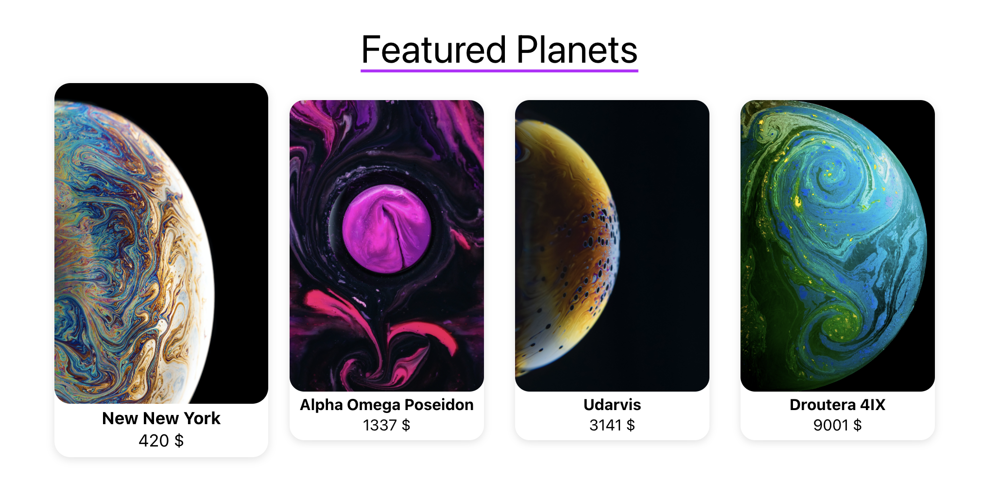
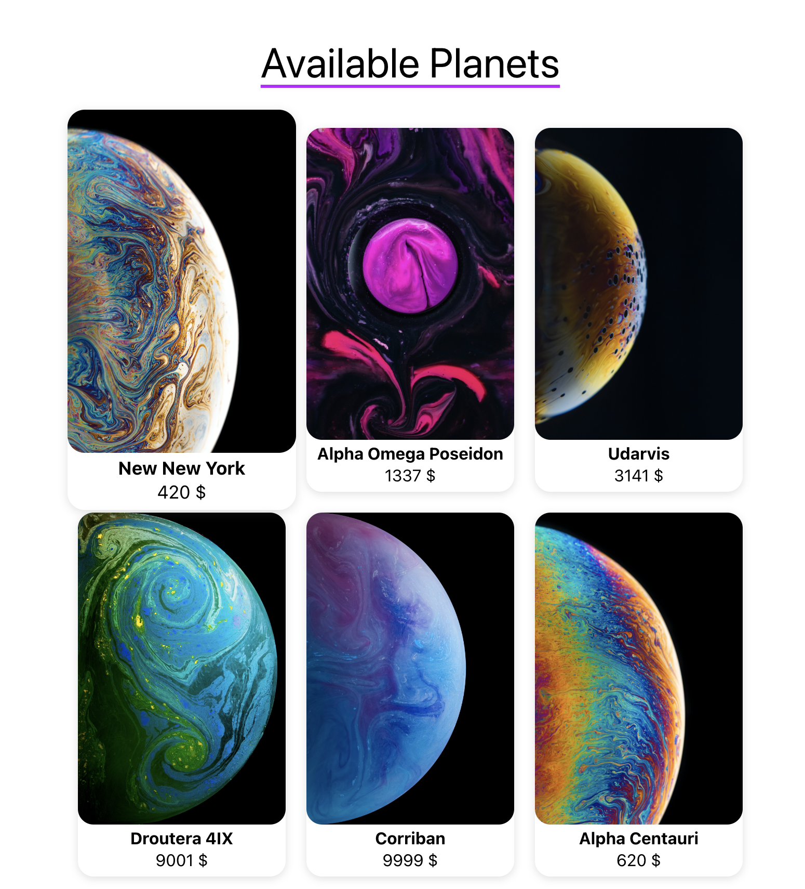
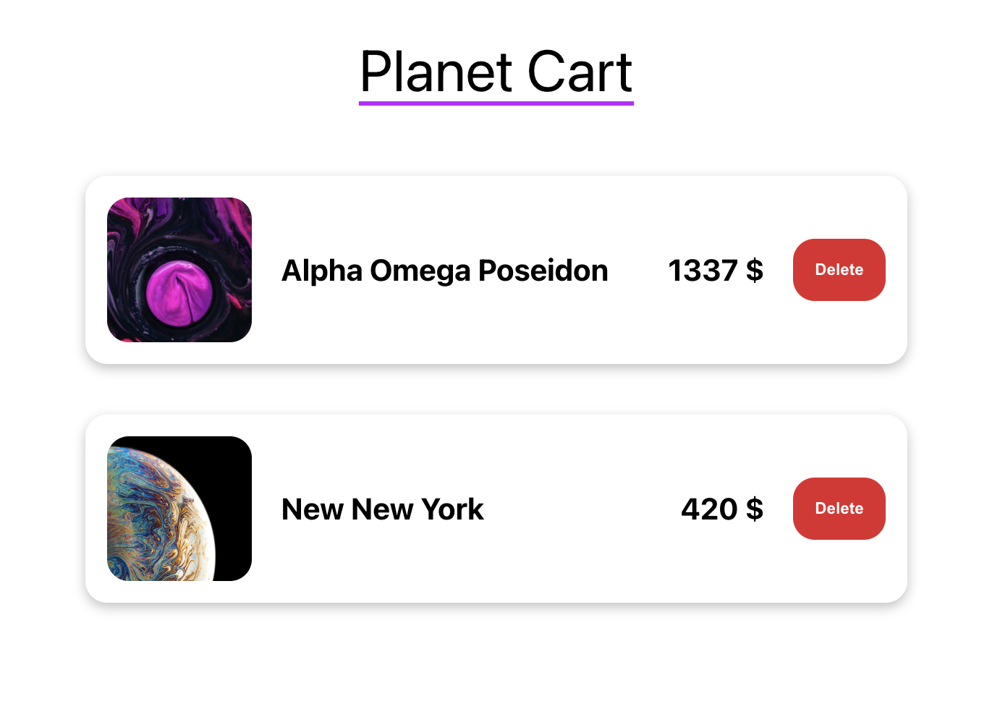

# odin-shopping-cart

### Planet shopping page

### Featured Planets

### Planet Cart page

## Access the page [here](https://benjamin-albarzendji.github.io/odin-shopping-cart/)

### Description

My third project using ReactJS. This time I have several pages, interactive elements, clever use of functions, sending information via objects. A linked mini system essentially. It was also built with ReactJS Router.

### Project Technologies:

- CSS
- HTML
- JavaScript
- ReactJS
- ReactJS Hooks
- ReactJS Router
- Webpack
